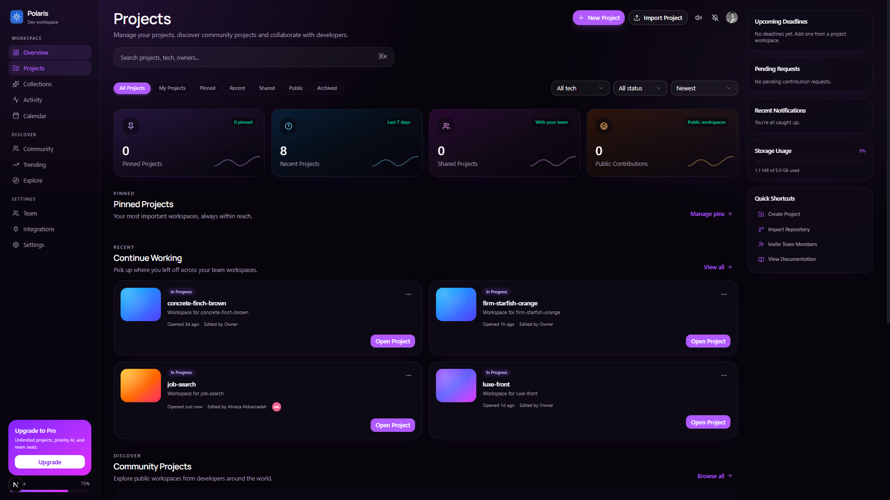
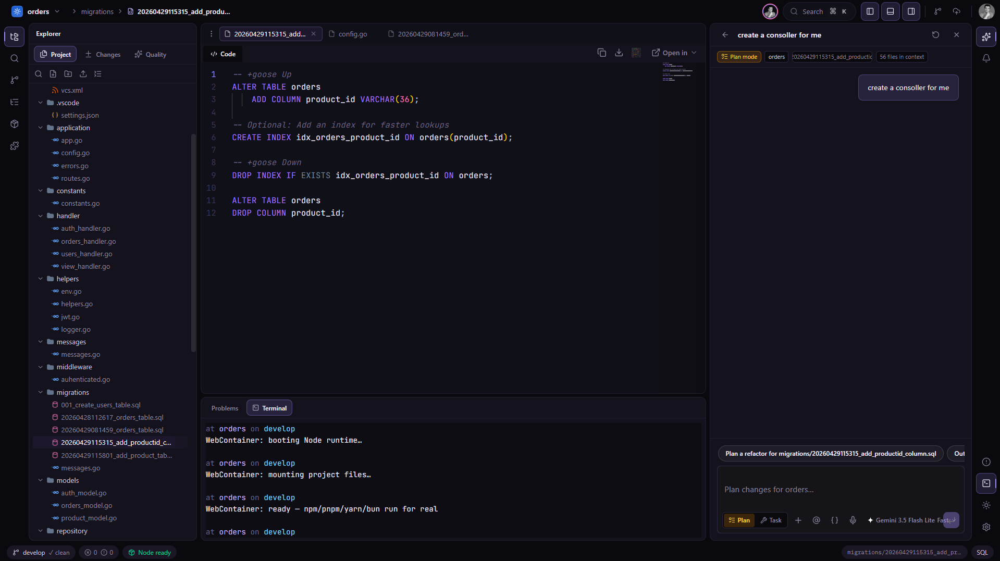

<p align="center">
  
</p>

<h1 align="center">NovaStudio</h1>

<p align="center">
  <strong>An AI-native collaborative IDE in the browser.</strong><br />
  Manage projects, edit with Monaco, run real Node in WebContainers,<br />
  sync with GitHub, and ship with your team — no desktop install.
</p>

<p align="center">
  <a href="#features">Features</a> ·
  <a href="#showcase">Showcase</a> ·
  <a href="#roadmap">Roadmap</a> ·
  <a href="#tech-stack">Tech stack</a> ·
  <a href="#getting-started">Getting started</a> ·
  <a href="CONTRIBUTING.md">Contributing</a> ·
  <a href="#feature-requests">Feature requests</a>
</p>

<p align="center">
  
  
  
  
  
  
</p>

---

## What is NovaStudio?

NovaStudio is a browser-based workspace for developers who want **editor + AI + git + terminal + live preview** in one place — closer to StackBlitz / CodeSandbox, but built as an **AI-first collaborative IDE**.

Create a project, clone from GitHub, invite teammates, and keep coding with:

- Monaco editor (tabs, split, Prettier, outline, go-to-definition)
- Real package installs via **WebContainers**
- Git status, diff, commit, push / pull, and branches
- Live collaboration (Liveblocks + Yjs)
- Context-aware AI chat next to your open files
- Project hub for pinning, searching, importing, and discovering work

---

## Showcase

### Projects hub

Organize private workspaces, continue recent projects, import from GitHub, and see activity at a glance.



### In-browser IDE

File tree, Monaco editor, AI sidebar, terminal, and preview — the full coding surface for a project like `job-search`.



---

## Features

### Shipped today

| Area | What you get |
|------|----------------|
| **Projects hub** | Create / import projects, search & filter, continue working, storage usage, shortcuts |
| **Monaco workspace** | Multi-file tabs, split views, Prettier, settings, outline / symbols, command palette (⌘⇧P) |
| **Navigation** | Go to File, Find in Files, Go to Definition (⌘/Ctrl-click · F12), Problems panel |
| **Git** | Status, history, stage / unstage, discard, side-by-side diff, commit & push / pull |
| **GitHub** | Connect account, clone repos, sync branches, publish from the workspace |
| **Runtime** | WebContainer Node terminal (`npm` / `pnpm` / `yarn` / `bun`), deps panel, hot reload preview |
| **Preview** | Device presets, URL bar, console overlay, error overlay, HMR when WC is running |
| **Collaboration** | Live presence, shared editing (Liveblocks + Yjs), invite / share flows |
| **AI** | In-workspace chat grounded in open files & project tree, model picker, plan / tool modes |
| **Extensions** | Marketplace for editor themes + Vue language pack; installs sync to your account |
| **Auth & billing** | Clerk sign-in, orgs / workspaces, pricing & Pro upgrade surface |
| **Notifications** | In-app alerts + optional web push |
| **Integrations** | GitHub, Linear, Notion, Slack/Discord, Vercel/Netlify, Google Calendar |

### Already strong (good places to contribute polish)

- File tree: create / rename / cut-copy-paste / drag-drop upload / keyboard
- Pin & preview tabs (VS Code–style)
- Workspace command palette + keyboard shortcuts
- Esbuild fallback preview when WebContainer is offline

Full sprint status lives in [`FEATURES.md`](./FEATURES.md).

---

## Roadmap

We implement **one feature at a time**, review UI + behavior, then move on.

### Needs contributors (open for PRs)

| Feature | Status | Why it matters |
|---------|--------|----------------|
| **Inline AI edit (⌘K in editor)** | `review` | Select code → rewrite → Accept / Reject |
| **Multi-file AI apply with diffs** | `todo` | Per-file diff cards, Apply all / Reject |
| **Zen / Focus mode** | `todo` | Hide chrome, center the editor |
| **Team hub** | `todo` | Members, roles, pending requests UI |
| **Slack / Linear / Discord / Vercel / Notion** | `coming-soon` | Integrations beyond GitHub |

### In review / polish

Pin tabs, drag-drop uploads, dependencies panel, WebContainer install + terminal, hot reload preview, Extensions marketplace, **Template gallery** (React / Vite / Next / Node / static) — see [`FEATURES.md`](./FEATURES.md).

### Later (hard infrastructure)

| Feature | Notes |
|---------|--------|
| Full Next/Vite host beyond esbuild | Deeper framework runtime |
| Debugger | Breakpoints & inspect |
| Workspace-wide Live Share | Terminal + preview beyond per-file Yjs |

> Want something not listed? Open a **Feature request** — see [below](#feature-requests).

---

## Tech stack

| Layer | Choice |
|-------|--------|
| App | [Next.js](https://nextjs.org) 16 (App Router) · React 19 · TypeScript |
| UI | Tailwind CSS 4 · Radix / Base UI · shadcn-style components · Motion |
| Backend | [Convex](https://convex.dev) (realtime DB + functions) |
| Auth / billing | [Clerk](https://clerk.com) |
| Collab | [Liveblocks](https://liveblocks.io) + Yjs |
| Editor | Monaco · Prettier · WebContainers · xterm |
| AI | Vercel AI SDK · Google models |
| Jobs | [Inngest](https://www.inngest.com) (e.g. GitHub clone pipeline) |
| Observability | Sentry |
| Deploy | Netlify / Vercel-friendly Next app |

```
src/
  app/                 # Next.js routes & API
  features/            # Domain modules (workspace, projects, github, …)
  components/          # Shared UI / AI elements
convex/                # Schema, queries, mutations, actions
```

---

## Getting started

### Prerequisites

- **Node.js** `>= 20.9`
- Accounts / keys for: **Clerk**, **Convex**, **Liveblocks** (and optionally GitHub OAuth via Clerk, Google AI, Inngest, Firecrawl, Sentry, VAPID)

### 1. Clone

```bash
git clone https://github.com/alireza-akbarzadeh/polaris.git
cd polaris
npm install
```

### 2. Environment

Copy the variables below into `.env.local` (and configure the same secrets in the Convex dashboard where noted).

```bash
# Clerk
NEXT_PUBLIC_CLERK_PUBLISHABLE_KEY=
CLERK_SECRET_KEY=
CLERK_JWT_ISSUER_DOMAIN=          # must match Convex; npm run auth:sync

# Convex
NEXT_PUBLIC_CONVEX_URL=
NEXT_PUBLIC_CONVEX_SITE_URL=
CONVEX_DEPLOYMENT=

# Liveblocks
NEXT_PUBLIC_LIVEBLOCKS_PUBLIC_KEY=
LIVEBLOCKS_SECRET_KEY=

# AI (optional for local AI chat)
GOOGLE_GENERATIVE_AI_API_KEY=

# Optional
FIRECRAWL_API_KEY=
INNGEST_DEV=1
NEXT_PUBLIC_SENTRY_DSN=
SENTRY_DSN=
SENTRY_AUTH_TOKEN=
VAPID_PUBLIC_KEY=                 # Convex env for push
VAPID_PRIVATE_KEY=
VAPID_SUBJECT=mailto:you@example.com

# Invite emails (set these in the Convex dashboard — required for invite emails)
# RESEND_API_KEY=re_...
# RESEND_FROM="NovaStudio <invites@yourdomain.com>"
# APP_ORIGIN=http://localhost:3000
```
### 3. Run locally

Use three terminals (or run backend + Inngest as needed):

```bash
# Terminal 1 — Convex
npm run backend

# Terminal 2 — Next.js
npm run dev

# Terminal 3 — Inngest (GitHub clone / background jobs)
npm run inngest:dev
```

Open [http://localhost:3000](http://localhost:3000).

### 4. Lint / build

```bash
npm run lint
npm run build
```

---

## Feature requests

We want clear, actionable requests from the community.

1. Search [existing issues](https://github.com/alireza-akbarzadeh/polaris/issues) and [`FEATURES.md`](./FEATURES.md) first.
2. Open a new issue with the **Feature request** template.
3. Include:
   - **Problem** — what friction you hit
   - **Proposal** — what you want built
   - **Why** — who it helps / how often
   - **Scope** — UI only, backend, integration, etc.
   - **Screenshots / mock** if you have them
4. Maintainers will label it (`enhancement`, `help wanted`, `roadmap`, …) and may fold it into [`FEATURES.md`](./FEATURES.md).

Bug reports use the **Bug report** template. Security issues: do **not** open a public issue — email the maintainers instead.

---

## Contributing

Contributions of all sizes are welcome — bugs, docs, UI polish, and roadmap features.

**Start here → [`CONTRIBUTING.md`](./CONTRIBUTING.md)**

Quick path:

1. Pick an issue labeled `good first issue` or `help wanted`, or a `todo` row in [`FEATURES.md`](./FEATURES.md).
2. Fork → branch → implement → open a PR.
3. Keep PRs focused (one feature or one fix).
4. Match existing patterns under `src/features/*` and Convex guidelines in `convex/_generated/ai/guidelines.md`.

---

## Project links

| Resource | Link |
|----------|------|
| Repository | [github.com/alireza-akbarzadeh/polaris](https://github.com/alireza-akbarzadeh/polaris) |
| Feature roadmap | [`FEATURES.md`](./FEATURES.md) |
| Contribute | [`CONTRIBUTING.md`](./CONTRIBUTING.md) |
| Convex guides | `convex/_generated/ai/guidelines.md` |

---

## License

This repository is currently **private / unlicensed for public reuse** unless the owners publish an open-source license. If you contribute, you agree that your contributions may be distributed with the project under whatever license the maintainers adopt later.

---

<p align="center">
  Built for developers who want the editor, the AI, and the git loop in one tab.<br />
  <strong>Star the repo · open an issue · ship a PR.</strong>
</p>
